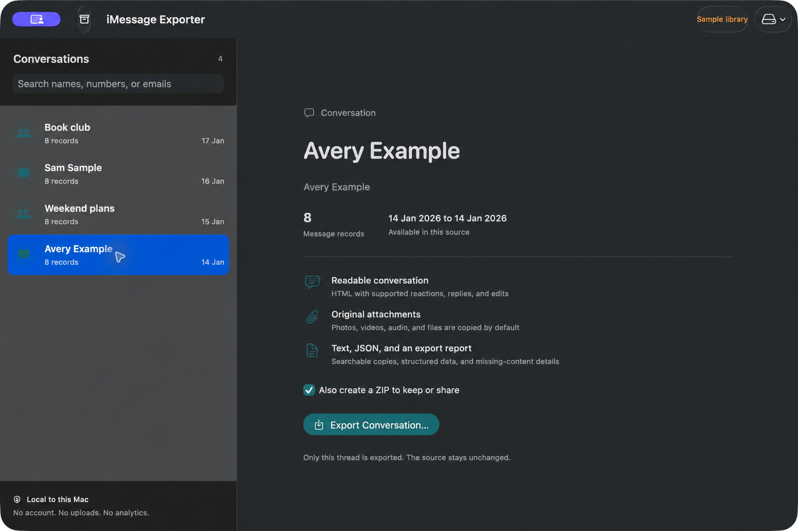

# iMessage Exporter

A free, open-source Mac app to export one iMessage conversation with its original
photos, videos, audio, and files. Everything is processed locally. No account,
uploads, subscriptions, or analytics.



*Captured from the app using invented sample conversations. Only the sample phone
number has been replaced with a contact name for this public screenshot.*

## Download

[Download the preview release](https://github.com/meeranmalik/imessage-exporter-desktop/releases/tag/v0.1.0).
Choose `iMessage-Exporter-0.1.0-macOS-universal.zip`, extract it, and move
**iMessage Exporter.app** to Applications. It supports Apple Silicon and Intel Macs
running macOS 13 Ventura or later. There is no Python, Homebrew, or Terminal setup
for app users.

**The first release is ad-hoc signed and is not notarized.** macOS may block its
first launch. Review the source and follow
[Apple's instructions for opening apps from identified sources](https://support.apple.com/en-us/102445)
if you choose to run it. A Developer ID signed and notarized release is still
needed for the standard trusted installation experience. Never disable Gatekeeper
or backup encryption to use this app.

## Export a conversation

1. Open **Mac Messages**, or choose an existing **unencrypted iPhone backup**.
2. Search by name, phone number, email, or group title. Select one conversation.
3. Click **Export Conversation**, then choose a folder. Original attachments are
   included by default. A ZIP is created by default too; you can switch that off.

For Mac Messages, macOS requires Full Disk Access. Go to **System Settings →
Privacy & Security → Full Disk Access**, add iMessage Exporter, then quit and reopen
the app. The app has a shortcut to this settings page. Contact-name lookup is
optional and uses the normal macOS Contacts permission prompt. Without it, you
can use phone numbers and emails.

For iPhone data, select the **device backup folder containing Manifest.db**, not
the top-level folder containing several device backups. Finder stores backups in
`~/Library/Application Support/MobileSync/Backup/`. The app can open that location.
Connecting or pairing an iPhone does not expose its live Messages database.
Create or update a local backup in Finder first; this app does not back up,
restore, or modify a phone.

## What you get

Each export is a new folder containing:

- `conversation.html`: an index linking to the readable chat and supplementary records.
- `conversation.txt`: a plain text transcript.
- `messages.json`: structured records, UTC timestamps, original metadata, and attachment references.
- `attachments/originals/`: original attachment files, without conversion.
- `readable-html/` and `readable-txt/`: transcripts and attachment copies made by the rendering engine.
- `export-report.json`: counts, missing attachments, undecoded text, and transcript status.
- Export logs for diagnosing rendering failures.

Keep the whole folder together so attachment links work. Some files are copied
more than once to keep both the structured archive and readable transcripts
portable. Allow enough disk space for those copies and the optional ZIP.

The app opens sources read-only. It filters a private temporary database copy
to the exact selected thread, then removes that temporary copy after the export.
Group conversations sharing the same participants are not implicitly included.
Recovered records and unjoined reactions are retained when associated with the
selected thread. The record count can include reactions and system events, so
it does not always equal the number of visible message bubbles.

## Current limits

- macOS only. Apple Silicon and Intel are packaged; execution on Intel hardware
  and the oldest supported macOS version has not yet been independently tested.
- Encrypted iPhone backups are not supported by this exact-thread selector yet.
  Keep encryption enabled and use Messages synced to your Mac instead.
- The app exports only the records and files present in the selected source.
  Cloud-only attachments, deleted data absent from the backup, and unfinished
  syncing cannot be recovered by exporting. Messages in iCloud may be absent
  from Finder backups.
- Original HEIC, CAF, MOV, and other files are preserved. Playback depends on
  the browser or app opening them. Interactive effects are rendered as supported
  by the engine; they are not recordings of the original animations.
- JSON preserves undecodable binary data as base64 and reports missing text.
  HTML and text use the more comprehensive `imessage-exporter` renderer.
- Closing the app during an export can leave partial output. The export report
  records incomplete runs when the operation is cancelled normally.

## Build from source

Requires Xcode or its Command Line Tools with Swift 6+, and Python 3 for the build
scripts. The application itself has no Python dependency.

```sh
python3 scripts/fetch-engine.py
MESSAGE_ARCHIVE_TEST_ENGINE="$PWD/ThirdParty/binaries/imessage-exporter-aarch64-apple-darwin" swift test
bash scripts/build-app.sh
```

On an Intel development Mac, use `imessage-exporter-x86_64-apple-darwin` in the test
command. The packaging script cross-compiles the native app for both architectures
and combines the verified upstream engine binaries. Output is in `dist/`.

For signed builds, set `SIGNING_IDENTITY` to an installed Developer ID Application
identity. Notarize and staple the resulting app before releasing it as notarized.
The default build uses an ad-hoc signature and is **not** notarized.

To package complete corresponding source alongside the app:

```sh
python3 scripts/vendor-engine.py
python3 scripts/release-artifacts.py
```

The source archive includes pinned upstream code and all Cargo.lock dependency
sources, with checksums. To rebuild the engine offline, install the Rust version
compatible with the upstream edition, then run `cargo build --locked --offline
--release -p imessage-exporter` from `ThirdParty/imessage-exporter-4.3.0/` in the source archive.

## Contribute

See [CONTRIBUTING.md](CONTRIBUTING.md). Use the built-in sample library for
screenshots and tests. Never submit real chats, databases, contact lists, backups,
or attachments in an issue or pull request.

GPL-3.0-only. This desktop app uses
[imessage-exporter](https://github.com/ReagentX/imessage-exporter) by ReagentX and
its contributors. See [third-party notices](ThirdParty/NOTICE.md). iMessage Exporter
is an independent project and is not affiliated with Apple.
